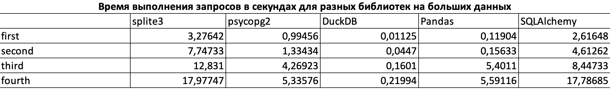

# third_lab

Лабораторная работа по базам данных №3

Описание проекта:

Проект реализован на двух типах данных: tiny и big. В каждом из 5 py файлов реализованы 4 sql запроса на каждую базу данных (tiny и big) для конкретной библиотеки.

SQL запросы:

1. SELECT VendorID, count(*) FROM trips GROUP BY 1;
2. SELECT passenger_count, avg(total_amount) FROM trips GROUP BY 1;
3. SELECT passenger_count, extract(year from tpep_pickup_datetime), count(*) FROM trips GROUP BY 1, 2;
4. SELECT passenger_count, extract(year from tpep_pickup_datetime), round(trip_distance), count(*)
     FROM trips GROUP BY 1, 2, 3 ORDER BY 2, 4 desc;

Впечатления от библиотек:

Библиотека duckdb мне понравилась больше всего из-за своей простоты в использовании и высокой скорости. С другой стороны, библиотека pandas мне понравилась меньше из-за более сложного синтаксиса по сравнению с другими библиотеками.

Графики:

1) На маленьких данных:

2) На больших данных:

Анализирование графиков:

DuckDB оказалась самой быстрой библиотекой для всех запросов и любого размера данных из-за выполнения запросов с использованием векторизации по столбцам, в отличие от SQLite, PostgreSQL и других, которые обрабатывают данные последовательно. Самыми медленными библиотеками оказались SQLite и SQLAlchemy, причем их скорость работы примерно одинакова, поскольку SQLAlchemy реализована на базе SQLite.